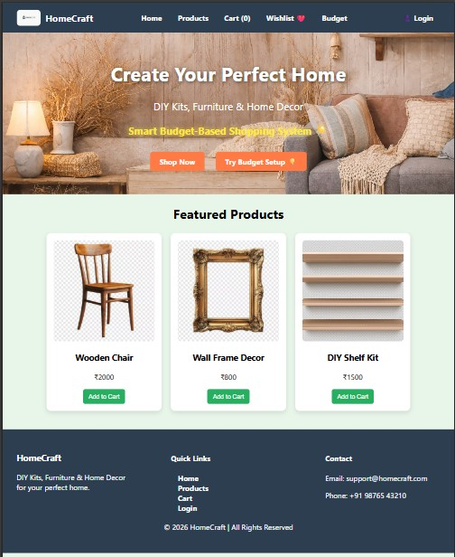
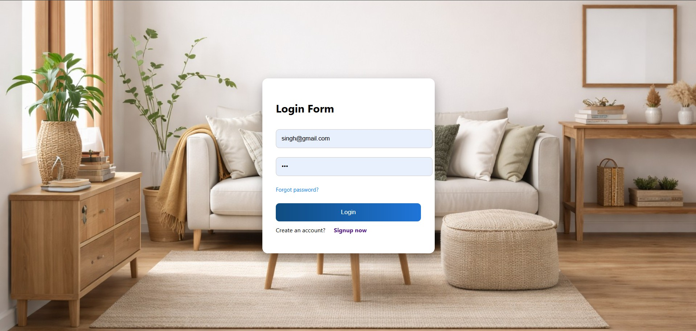
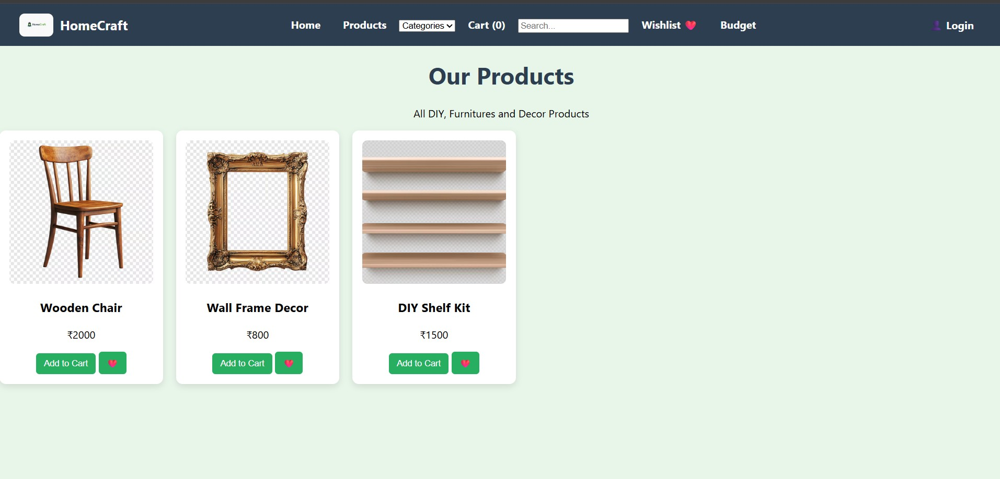
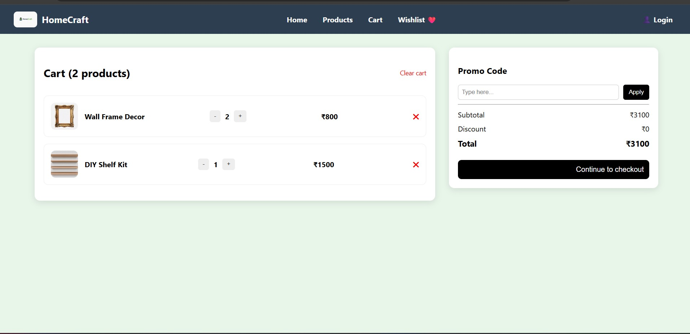
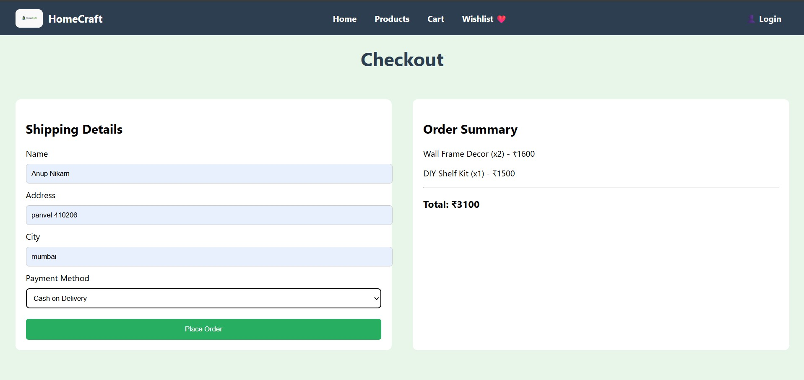
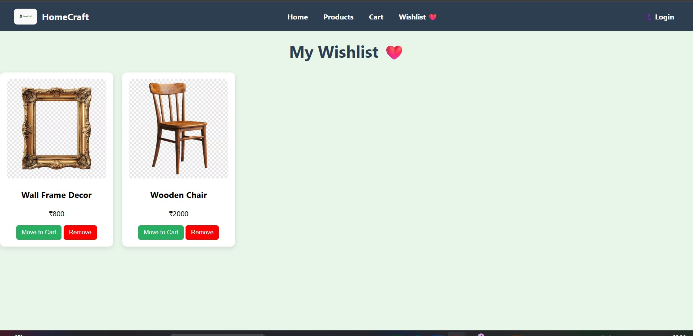
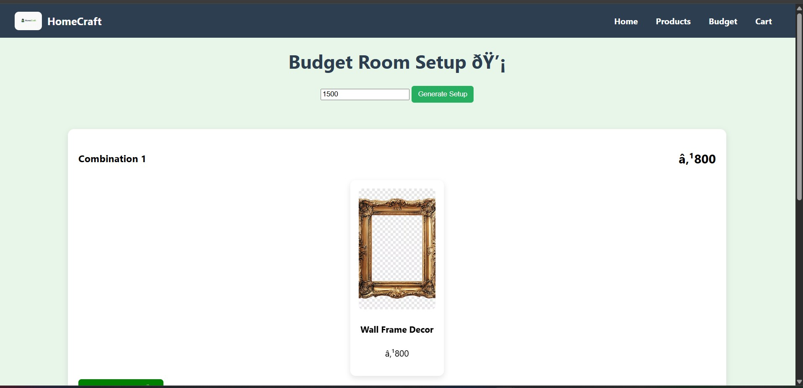

# HomeCraft — Mini Project Report

HomeCraft is a DIY and home improvement e-commerce website implemented using **HTML, CSS, JavaScript, PHP, and MySQL**. This project includes both front-end UI and backend integration such as user authentication, cart handling, and order management.

---

## Table of Contents

* Overview
* Features
* Architecture & Design

  * File structure
  * Page responsibilities (modules)
  * Backend / Database
  * API surface
* How to run / preview
* Challenges faced
* Contributions
* Screenshots (app flow)

---

## Overview

HomeCraft provides a simple and clean e-commerce experience focused on DIY and home-improvement products. The project demonstrates **full-stack web development**, including UI design, backend logic, and database integration.

This project is a **dynamic web application** where users can register, login, add products to cart, and place orders which are stored in the database.

---

## Features

* Landing / home page showcasing hero banner and featured items (`index.php`)
* Product catalog listing (`products.html`)
* Wishlist functionality (`wishlist.php`)
* Cart page using localStorage (`cart.php`)
* Checkout page with order placement (`checkout.php`)
* User authentication system (`login.php`, `signup.php`)
* Budget planner (`budget.html`)
* Session-based authentication (restricted page access)
* Order data stored in MySQL database

---

## Architecture & Design

### File structure (important files):

* `index.php` — Landing page (protected with session)
* `products.html` — Product listing
* `cart.php` — Shopping cart
* `checkout.php` — Checkout and order placement
* `login.html`, `signup.html` — UI forms
* `login.php`, `signup.php` — Backend authentication
* `place_order.php` — Order storage
* `db.php` — Database connection
* `wishlist.php` — Wishlist page
* `budget.html` — Budget planner
* `css/style.css` — Styles
* `images/` — Assets

---

### Page responsibilities (modules):

* Navigation / Header / Footer: shared layout across pages
* Product listing: display products and allow add to cart/wishlist
* Cart: manage items using localStorage
* Checkout: collect user details and place order
* Authentication: login/signup using PHP and MySQL
* Budget planner: generate combinations based on budget

---

### Backend / Database

The project uses **PHP for backend** and **MySQL for database**.

Database: `homecraft`

Tables:

* users (id, name, email, password)
* orders (id, name, address, city, payment, total)

---

### API surface

Internal APIs implemented using PHP:

* `signup.php` → Register new user
* `login.php` → Authenticate user
* `place_order.php` → Store order in database

---

## How to run / preview

1. Place project inside `htdocs` (XAMPP)
2. Start Apache and MySQL
3. Open browser:

```
http://localhost/WEB_PROGRAM/login.html
```

---

## Challenges faced

* Connecting frontend with backend using PHP
* Managing session-based authentication
* Handling cart using localStorage
* Debugging database connection issues (port, config)
* Handling redirects and authentication flow

---

## Contributions

* Anup Nikam — Backend Development (PHP, MySQL), Authentication System, Database Integration, UI Design
* Abhishek Nair — Frontend Development (Home, Cart and Checkout Pages)
* Adarsh Patil — Frontend Development (Product Pages), JavaScript Functionality

---

## Screenshots (app flow)

### 🏠 Home Page


### 🔐 Login Page


### 🛍️ Products Page


### 🛒 Cart Page


### 💳 Checkout Page


### ❤️Wishlist Page


###  ð Budget Page


---

